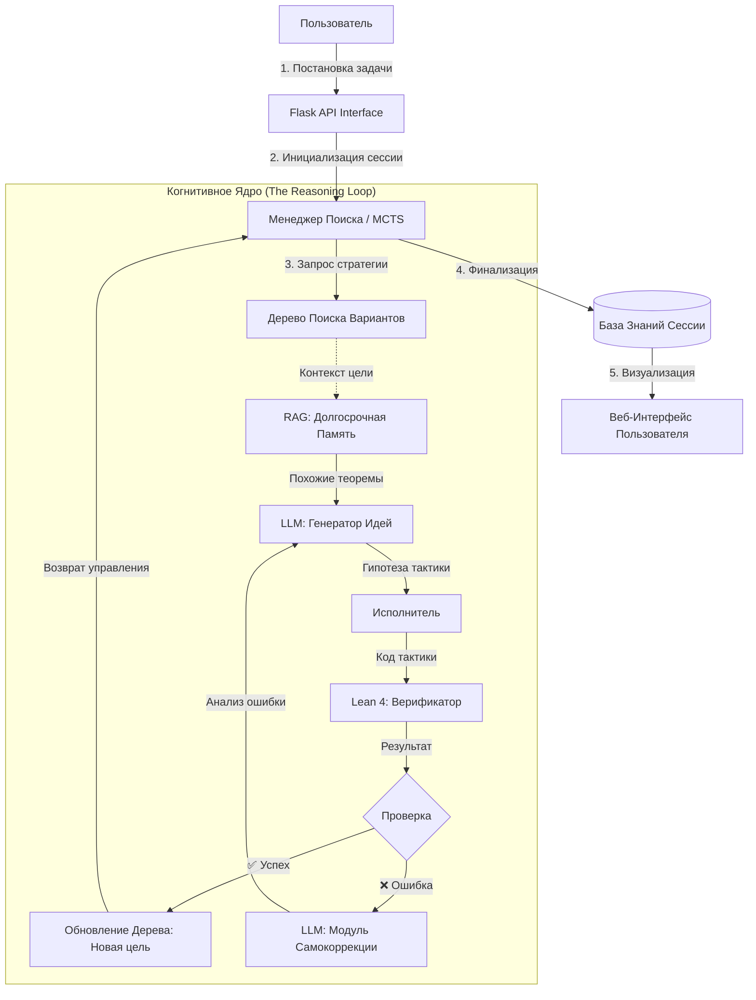

# 🧠 Как работает AlphaMath: Архитектура Нейро-Символического Разума

AlphaMath — это не просто чат-бот, решающий задачи. Это реализация передовой концепции **Нейро-Символического Искусственного Интеллекта (Neuro-Symbolic AI)**, архитектурно вдохновленная проектом **AlphaProof** от Google DeepMind.

В основе системы лежит идея объединения двух фундаментально разных подходов к вычислениям:
*   **Нейронная интуиция (System 1)**: Большие языковые модели (LLM), которые обладают "творческим" мышлением, могут выдвигать гипотезы и видеть неочевидные связи, но склонны к галлюцинациям и фактическим ошибкам.
*   **Символическая строгость (System 2)**: Формальные верификаторы (**Lean 4**), которые работают по жестким законам логики. Они не умеют "фантазировать", но гарантируют 100% математическую истину.

AlphaMath — это "оркестратор", который заставляет эти две системы работать в тандеме, управляя их взаимодействием через алгоритм **Поиска по Дереву Монте-Карло (MCTS)**.

## 🏗 Архитектура и Поток Рассуждений

Система построена как автономный агент, способный к самокоррекции. В отличие от линейного выполнения (как в обычном скрипте), здесь реализован циклический процесс мышления.

### Схема взаимодействия компонентов



## 🧩 Глубокое погружение в компоненты

### 1. Менеджер Поиска (Search Manager): Стратег
**Файл:** `backend/search_manager.py`

Это центральный "мозг" системы. Обычные LLM пытаются угадать ответ сразу. AlphaMath понимает, что сложные задачи требуют планирования.

*   **Философия поиска**: Доказательство теоремы — это поиск пути в лабиринте. Менеджер использует алгоритм **MCTS (Monte Carlo Tree Search)**, который изначально был разработан для игры в Го и Шахматы.
*   **Баланс (Exploration vs Exploitation)**: Используя формулу **UCT (Upper Confidence Bound applied to Trees)**, агент решает дилемму:
    *   **Эксплуатация**: Выбрать тактику, в которой LLM уверен (высокая вероятность успеха).
    *   **Исследование**: Попробовать неочевидный ход, который имеет низкую вероятность, но может привести к короткому решению.
*   **Оценка позиций**: Агент не просто перебирает варианты. Он просит LLM оценить "перспективность" текущего математического состояния (state value), отсекая тупиковые ветви развития доказательства.

### 2. Интеграция с Lean 4 (The Verifier): Судья
**Файл:** `backend/lean_server.py`

Это "силовое поле" реальности. В мире AlphaMath невозможно солгать.

*   **Компиляция как Верификация**: Любой текст, сгенерированный нейросетью, немедленно отправляется в фоновый процесс Lean 4. Если код компилируется — это истина. Если нет — это фантазия.
*   **Инкрементальность**: Система помнит состояние доказательства (контекст, открытые переменные, гипотезы) и проверяет новые шаги строго в этом контексте. Это позволяет строить доказательство шаг за шагом.
*   **Обратная связь (Feedback Loop)**: Это ключевое отличие от ChatGPT. Когда Lean выдает ошибку, AlphaMath не игнорирует её. Текст ошибки возвращается в LLM, запуская процесс **Reflexion (Рефлексия)** — модель анализирует, почему она ошиблась, и предлагает исправление.

### 3. RAG Система (Retrieval-Augmented Generation): Эрудит
**Файл:** `backend/build_index.py`

Математика — это гигантская структура знаний. LLM имеет ограниченное "окно внимания". RAG — это "библиотечный билет" агента.

*   **Векторный Индекс**: Мы превращаем всю библиотеку Mathlib (десятки тысяч теорем) в математические векторы (эмбеддинги) с помощью модели `sentence-transformers`.
*   **Контекстный Поиск**: Когда агент видит задачу про "простые числа", система автоматически подтягивает ему в контекст 5-10 самых релевантных лемм из библиотеки. Это позволяет агенту использовать теоремы, которые он мог "забыть" или не знать в деталях.

### 4. Промпт-инжиниринг: Искусство диалога
**Файл:** `backend/llm_prompts.py`

Мы не просто просим "реши задачу". Мы моделируем процесс мышления математика через каскад специализированных промптов:

*   **Formalization**: Перевод человеческого языка в строгий синтаксис Lean.
*   **Proof Sketching**: "Сначала опиши план решения словами". Это помогает модели структурировать логику до написания кода (Chain-of-Thought).
*   **Tactic Generation**: "Учитывая текущую цель и ошибку предыдущего шага, напиши только следующую строку кода".
*   **Repair**: "Ты попытался использовать тактику X, но Lean сказал Y. Исправь синтаксис".

## 🔄 Жизненный цикл доказательства: Пример из жизни

Представим, что пользователь просит: *"Докажи, что если n четное, то n+2 тоже четное"*.

1.  **Стадия Формализации**:
    Агент переводит запрос в Lean-код:
    ```lean
    example (n : ℕ) (h : Even n) : Even (n + 2) := by
    ```

2.  **Начало Поиска (Корень Дерева)**:
    *   **Цель**: `⊢ Even (n + 2)`
    *   **Действие**: Агент опрашивает RAG. RAG подсказывает определение четности: `Even a ↔ ∃ k, a = 2*k`.

3.  **Ветвление (MCTS)**:
    *   **Вариант А**: "Раскрыть определение Even в гипотезе h". (Оценка LLM: 0.95)
    *   **Вариант Б**: "Применить индукцию по n". (Оценка LLM: 0.4)

4.  **Выполнение (Execution)**:
    *   Агент выбирает **Вариант А** (самый высокий скор). Генерирует тактику: `cases h with k hk`.
    *   Отправляет в Lean.

5.  **Верификация**:
    *   Lean отвечает: ✅ Success. Состояние меняется.
    *   **Новая цель**: `⊢ Even (2*k + 2)`.

6.  **Следующий шаг**:
    *   Агент видит новую цель. Генерирует тактику: `use k + 1`.
    *   Lean: ✅ Success.
    *   **Новая цель**: `⊢ 2*(k + 1) = 2*k + 2`.

7.  **Финал**:
    *   Агент предлагает: `ring`. (Тактика для автоматических алгебраических упрощений).
    *   Lean отвечает: `Goals accomplished`.

8.  **Результат**: Система сворачивает успешный путь в дереве в готовый код и выдает пользователю.

## 💾 Хранение данных (SQLite)

Все сессии сохраняются локально в `mathag.db`.
*   Таблица `sessions`: Хранит ID, статус, исходную задачу и финальный ответ.
*   Поле `tree_data`: Содержит полный JSON-дамп дерева поиска, что позволяет "переиграть" процесс мышления агента в UI.

## 🚀 Почему это важно? (Концептуальное значение)

Мы стоим на пороге кризиса доверия к ИИ. Генеративные модели могут написать эссе, но в науке и инженерии "почти правильно" означает "катастрофически неверно".

AlphaMath решает проблему галлюцинаций радикальным методом:
*   Ни одна строка ответа не показывается пользователю, пока она не доказана математически.
*   Мы заменяем вероятностную правду (probability) на доказуемую истину (provability).

Это прототип будущего научного помощника, который сможет не просто искать информацию, но и самостоятельно открывать новые знания, гарантируя их корректность.
