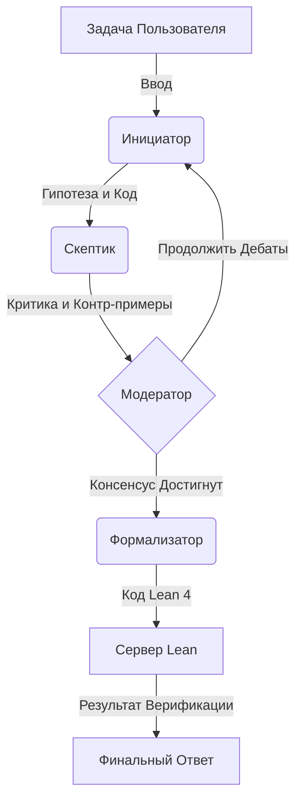

# Как работает Chatterbox

Chatterbox — это **Диалектический Математический Движок**, который решает задачи посредством состязательного сотрудничества (adversarial collaboration). Вместо того чтобы полагаться на одну модель, он организует дебаты между специализированными агентами, имитируя процесс рецензирования в научном сообществе.

## 🏗 Архитектура Диалога

Система реализует диалектический цикл, где идеи предлагаются, жестко критикуются, оцениваются и, наконец, доказываются.

## 🎭 Роли Агентов

Система состоит из четырех различных персон, каждая со своей ролью и "личностью" (настраивается через температуру и промпты):

### 1. 💡 Инициатор (Promoter)
*   **Модель**: `google/gemini-2.0-flash-exp`
*   **Роль**: Предлагает смелые гипотезы, креативные решения и симуляции на Python.
*   **Личность**: Оптимистичный, изобретательный.
*   **Функция**: Генерирует первоначальный подход и улучшения.

### 2. 🧐 Скептик (Skeptic)
*   **Модель**: `deepseek-r1-distill-qwen-32b`
*   **Роль**: Безжалостно критикует идеи Инициатора. Ищет граничные случаи, логические ошибки и ошибки "на единицу" (off-by-one).
*   **Личность**: Пессимистичный, строгий, внимательный к деталям.
*   **Функция**: Предотвращает галлюцинации, оспаривая предположения.

### 3. ⚖️ Модератор (Moderator)
*   **Модель**: `google/gemini-2.0-flash-exp`
*   **Роль**: Наблюдает за дебатами. Решает, когда аргументация заходит в тупик, когда достигнут консенсус или когда нужно остановиться.
*   **Функция**: Управляет потоком цикла и запускает фазу формализации.

### 4. 📐 Формализатор (Formalizer)
*   **Модель**: `deepseek-prover-v2`
*   **Роль**: Переводит согласованное неформальное решение в строгий код Lean 4.
*   **Функция**: Обеспечивает окончательную проверку истинности (ground-truth verification).

## 🔄 Диалектический Цикл

Ядром Chatterbox является функция `run_debate_cycle` в `main.py`:

1.  **Предложение (Proposal)**: **Инициатор** предлагает решение или эскиз доказательства.
2.  **Критика (Critique)**: **Скептик** анализирует предложение и указывает на недостатки.
3.  **Обсуждение (Deliberation)**: **Модератор** оценивает обмен мнениями.
    *   Если найдены недостатки -> Возврат к Инициатору для исправления.
    *   Если логика верна -> Переход к Формализации.
4.  **Формализация (Formalization)**: **Формализатор** конвертирует логику в теорему Lean.
5.  **Верификация (Verification)**: Система запускает **Lean Server** для компиляции кода.
    *   Если компилируется -> Успех!
    *   Если ошибка -> Ошибка возвращается в цикл (для будущих улучшений).

## 🛠 Техническая Реализация

*   **Оркестрация**: Цикл на Python, управляющий историей разговора.
*   **Интеграция с Lean**: Кастомный `LeanServerProcess` взаимодействует с Lean 4 LSP (Language Server Protocol) для проверки кода на лету.
*   **Управление Проектом**: Автоматически инициализирует проект Lean (`math_proofs`), если он не существует.

## 🌟 Почему такой подход?

Большие языковые модели часто "галлюцинируют", выдавая правдоподобно звучащую, но неверную математику. Заставляя **Скептика** критиковать **Инициатора**, мы значительно снижаем количество ошибок. Добавляя **Формализатора**, мы гарантируем, что конечный результат математически обоснован, а не просто убедителен текстуально.
